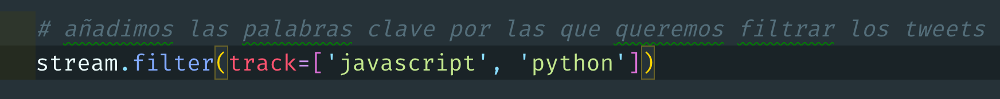

# Tweepy streamer CSV

Scripts hechos en **python**, con los que se podrá obtener tweets en tiempo real y continuo, ideal para obtener gran cantidad de tweets, para el análisis de los mismos, mediante el uso de la **API** para twitter **`tweepy`**.

## Requerimientos

- **Instalar [PYTHON](PYTHON "https://www.python.org/downloads/").**
- **Instalar TWEEPY**, abre terminal y escribe **`pip3 install tweepy`**.
- **Credenciales de desarrollador de [TWITTER](TWITTER "https://developer.twitter.com/")**.
Modificar el archivo **`credentials.py`** y añadir vuestras **credenciales de desarrollador de twitter**.

## Uso

Primero de todo, debemos añadir el **filtro para capturar solamente los tweets que nos interesan**, podemos usar solo una palabra o varias, para ellos debemos de editar el archivo **`tweepyStreamer.py`** y modificar el **track para añadir nuestras palabras filtro**.

Lanzamos el script del **`tweepyStreamer.py`**, y la información se irá escribiendo en el archivo **`tweets.csv`**. Para finalizar el **streamer bastará con cerrar la terminal donde se esta ejecuntado**.

## Salida

Las salidas de los **tweets** serán en formato **`.csv`**, el formato de los tweets siempre será en modo **extendido**, es decir **obtendremos el texto que compone el tweet completo**.

## Licencia

Este repositorio está disponible bajo los términos de la licencia **GPL-3.0.** Vea **[COPYING](COPYING "COPYING")** para más detalles.